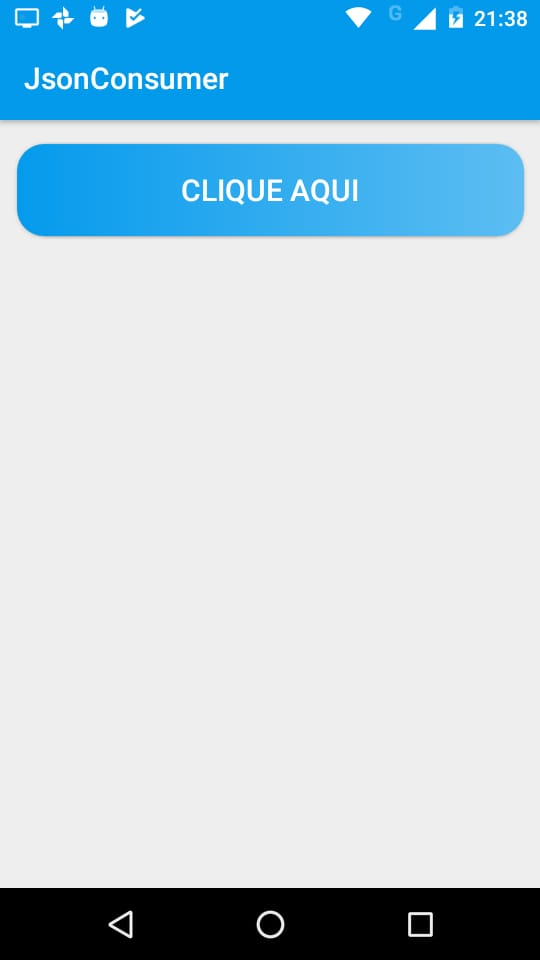

# JsonConsumer
Projeto JsonConsumer da empresa [PontoTel](https://www.pontotel.com.br), 
projeto desenvolvido em Kotlin, onde é feito uma requisição para um endpoint e posteriormente exibido uma lista.

# Instalação
- Está anexado neste projeto o arquivo apk. A apk pode ser baixado clicando 
[aqui](https://github.com/0tavi0/JsonConsumer/blob/master/app-debug.apk).

# ScreenShots

  
  
  

# Projeto
O projeto consiste em efetuar uma requesição para um endpoint e onde é exibido uma lista de user.

## Arquitetura
Neste projeto utilizei a arquitetura MVP pela facilidade de manutenção e futuras implementações.

## Bibliotecas
- [Retrofit](https://square.github.io/retrofit/): Biblioteca escolhida para requisições das APIs.
- [Gson](https://github.com/google/gson): Biblioteca da Google, para deserializar o retorno da API.

# Author
- Otávio Augusto - otavio.le@gmail.com  
 
